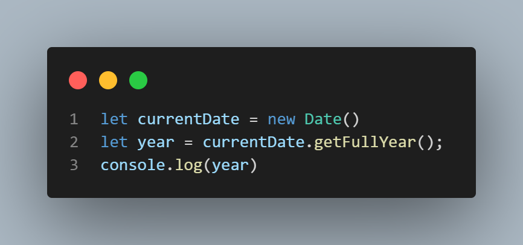
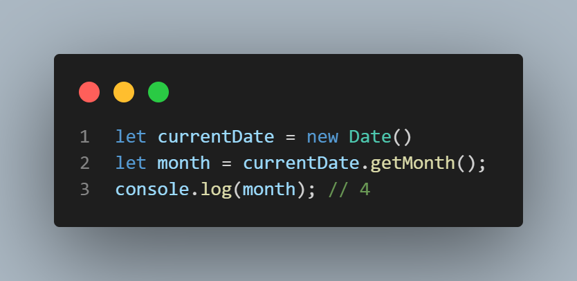
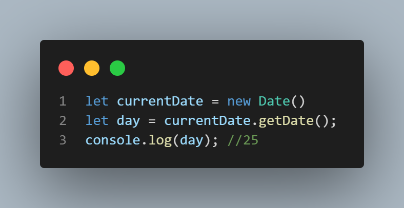
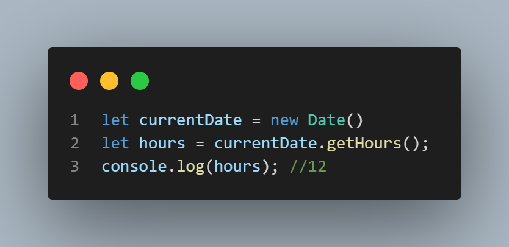
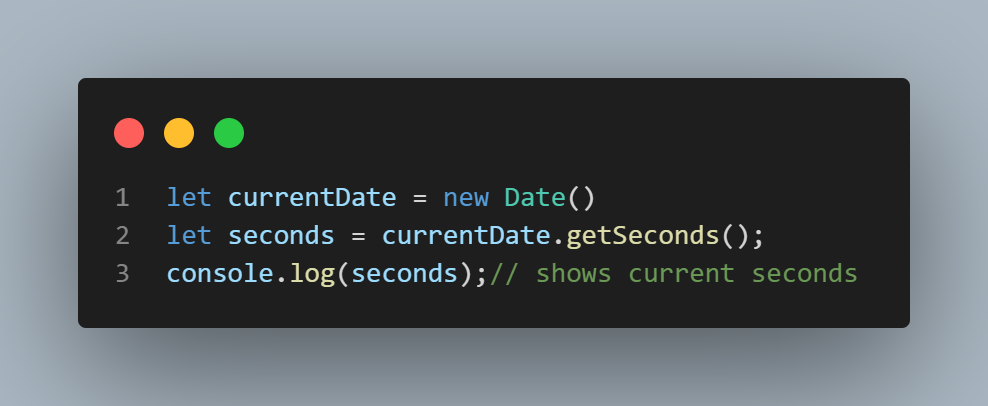
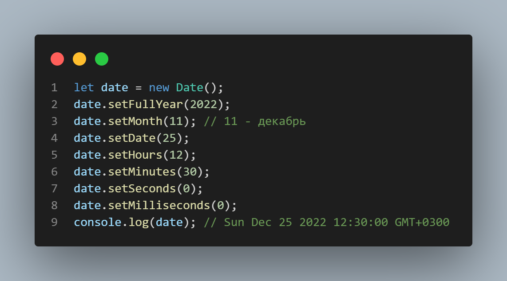

# new-Date-lecture

*****
## Data and time

"new Date" **в JavaScript** – это тип данных, который представляет дату и время. Этот объект используется для работы с датами и временем в JavaScript.

С помощью "new Date" вы можете создавать объекты с указанием определенных дат и времени или без них. Объекты даты можно использовать для выполнения математических операций, таких как дополнение, вычитание, сравнение и т.д

Дата JavaScript определяет эпоху EcmaScript, которая представляет миллисекунды.
с 1 января 1970 года по всемирному координированному времени. Эта дата и время совпадают с эпохой UNIX.
(преобладающее базовое значение для записанных компьютером значений даты и времени).

Например, чтобы создать объект даты, соответствующий текущим дате и времени, можно использовать следующую команду: 

***const currentDate = new Date();***

Либо, чтобы создать объект даты с определенной датой и временем, можно использовать такой код:

***const specificDate = new Date(2022, 10, 25, 10, 30, 0);***

Этот код создаст объект даты, соответствующий 25 ноября 2022 года в 10 часов 30 минут 0 секунд
****

**Creating Date Objects**

**Существует четыре способа создания объекта даты.**

1. `new Date()`

2. `new Date(milliseconds)`

3. `new Date(Date string)`

4. `new Date(year, month, day, hours, minutes, seconds,
milliseconds)`
****
- `new Date()` - создает объект с текущей датой и временем;
****
- `new Date(milliseconds)` - создает объект с датой, соответствующей заданному количеству миллисекунд прошедших с 1 января 1970 года;

****
- `new Date(dateString)` - создает объект с датой, соответствующей строке в формате, который может быть разобран вызовом методов `Date.parse()` или `Date.UTC()`;

****
- `new Date(year, month, day, hours, minutes, seconds)` - создает объект с определенной датой и временем в указанных часовых поясах;
******

- `new Date(year, month, day)` - создает объект с определенной датой в локальной часовой зоне;

*****
- `new Date(timeValue)` - синтаксический сахар для `new Date(milliseconds)` (например, `new Date('2022-12-31')` эквивалентно `new Date(Date.parse('2022-12-31'))`).

*****
### Date Methods

`getFullYear()` - возвращает год указанной даты.

`getMonth()` - возвращает месяц указанной даты (начиная с 0).

`getDate()` - возвращает число месяца указанной даты (от 1 до 31).

`getHours()` - возвращает час указанной даты (от 0 до 23).

`getSeconds()` - возвращает секунды указанной даты (от 0 до 59).

******
***В JavaScript, объект `Date` имеет набор методов `set`, которые позволяют установить значения даты и времени в объекте `Date`. Ниже перечислены методы `set` для различных компонентов даты и времени:***

1. `setFullYear(year [, month [, date]])` - устанавливает год, месяц и день указанной даты. Если `month` и `date` не указаны, они устанавливаются на текущий месяц и день.

2. `setMonth(month [, date])` - устанавливает месяц и день указанной даты. Если `date` не указан, он устанавливается на текущий день.

3. `setDate(date)` - устанавливает день указанной даты

4. `setHours(hour [, min [, sec [, ms]]])` - устанавливает часы, минуты, секунды и миллисекунды указанной даты. Если `min`, `sec` и `ms` не указаны, они устанавливаются на текущие значения.

5. `setMinutes(min [, sec [, ms]])` - устанавливает минуты, секунды и миллисекунды указанной даты. Если `sec` и `ms` не указаны, они устанавливаются на текущие значения.

6. `setSeconds(sec [, ms])` - устанавливает секунды и миллисекунды указанной даты. Если `ms` не указан, он устанавливается на текущие значение.

7. `setMilliseconds(ms)` - устанавливает миллисекунды указанной даты.

